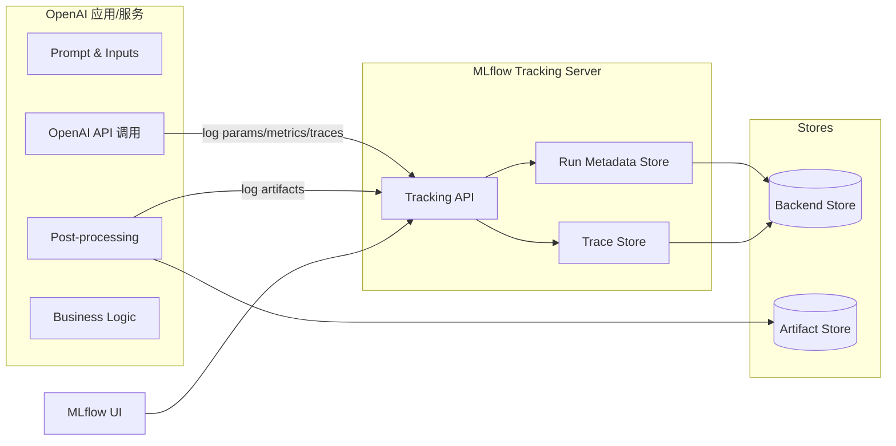
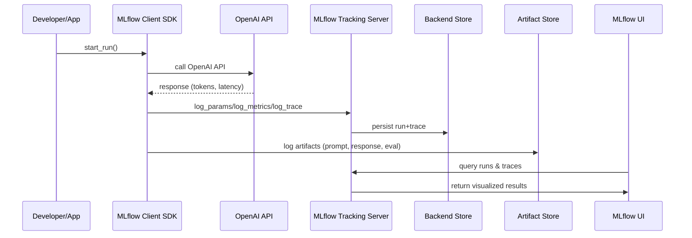
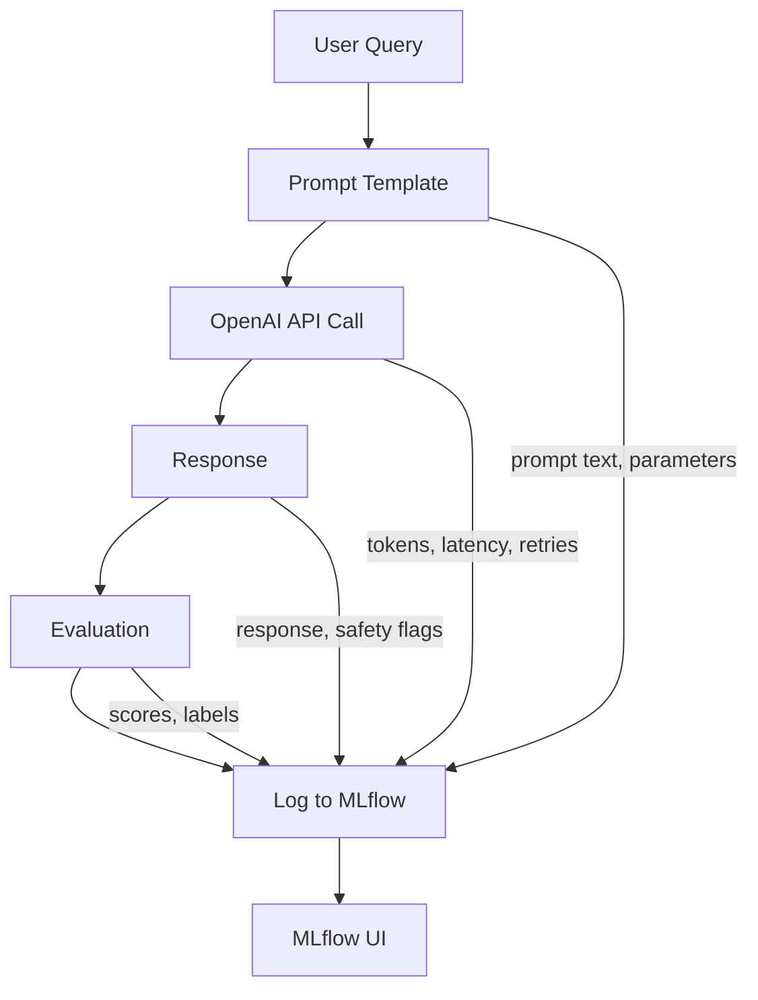

# MLflow 架构与 Observability（以 OpenAI 应用为例）

下面以 “OpenAI 应用/服务” 为例，简要讲解 MLflow 的架构、主要组件与典型 workflow，并用 Mermaid 图示说明 MLflow 如何帮助实现 observability（可观测性）。

## 核心组件

- **Tracking Server**：接收并存储实验/运行数据（参数、指标、artifact、trace）。
- **Backend Store**：存元数据（默认 SQLite，也可用 Postgres/MySQL）。
- **Artifact Store**：存文件类产物（模型、日志、报告、提示词、评测结果）。
- **Client SDK**：应用/训练代码通过 SDK 记录日志、指标与 traces。
- **MLflow UI**：可视化探索实验/运行/评测/trace。
- **Model Registry（可选）**：模型版本管理与部署治理。
- **LLM Tracing & Evaluation（可选）**：记录 LLM 调用链与评测结果。

## 架构图（OpenAI 应用接入 MLflow）



## 典型 Workflow（OpenAI 应用）



## MLflow 如何帮 OpenAI 实现 Observability

### 1) Tracing：捕捉 LLM 调用链

- 记录：prompt、模型、temperature、token 使用量、延迟、重试等
- 可串联：工具调用、检索、路由、多步推理
- 价值：定位“响应慢/内容不稳定/成本高”的具体原因

### 2) Metrics：量化质量与成本

- 质量指标：准确率、BLEU、ROUGE、人工评分等
- 成本指标：token 数、调用次数、失败率、延迟
- 价值：比较不同 prompt / 参数 / model 的效果与成本

### 3) Artifacts：留存关键产物

- 保存：prompt、response、评测报告、错误日志
- 价值：可重放、可审计、可回溯

### 4) 可视化 UI：快速对比与诊断

- 运行对比：不同 prompt / 模型版本 / 参数
- Trace 诊断：查看单次请求完整调用链

## 与 OpenTelemetry 集成（示例）

如果你的 OpenAI 应用已经使用 OpenTelemetry 做分布式追踪，可以把 OTel 的 trace/span 与 MLflow 运行关联起来。常见做法是：

1) 使用 OTel 创建 span 包裹 OpenAI 调用。
2) 将 `trace_id` / `span_id` 作为 MLflow 的 tags 或 params 记录。
3) 在 MLflow UI 中点击或检索这些 ID，跳转到你的 OTel 后端（如 Jaeger、Tempo、Honeycomb）。

下面是一个最小示例（伪代码风格，展示关键步骤）：

```python
from opentelemetry import trace
from opentelemetry.sdk.trace import TracerProvider
from opentelemetry.sdk.trace.export import BatchSpanProcessor
from opentelemetry.exporter.otlp.proto.http.trace_exporter import OTLPSpanExporter

import mlflow
# import openai  # 你的 OpenAI SDK

# 1) OTel 基础配置
provider = TracerProvider()
provider.add_span_processor(
    BatchSpanProcessor(OTLPSpanExporter(endpoint="http://localhost:4318/v1/traces"))
)
trace.set_tracer_provider(provider)
tracer = trace.get_tracer("openai-app")

with mlflow.start_run():
    # 2) 用 span 包裹 OpenAI 调用
    with tracer.start_as_current_span("openai.chat") as span:
        # response = openai.chat.completions.create(...)
        # span.set_attribute("openai.model", "gpt-4.1-mini")
        # span.set_attribute("openai.temperature", 0.2)
        pass

        # 3) 将 trace/span id 写入 MLflow
        ctx = span.get_span_context()
        mlflow.set_tag("otel.trace_id", format(ctx.trace_id, "032x"))
        mlflow.set_tag("otel.span_id", format(ctx.span_id, "016x"))
```

如果你使用了 OpenAI 的 OTel instrumentation（或框架层如 FastAPI/Django 的 OTel instrumentation），也可以直接复用已有 spans，仅在 MLflow 侧补充 `trace_id` / `span_id` 关联信息即可。

## `mlflow.openai.autolog()` 如何工作

`mlflow.openai.autolog()` 会对 OpenAI SDK 的关键方法进行“安全补丁”注入，从而在每次调用时自动创建 MLflow trace/span，并记录输入、输出与错误。核心流程如下：

1) **版本检查**：仅支持 `openai>=1.0`，否则抛错。  
2) **方法 patch**：对 `chat.completions`、`completions`、`embeddings`、`responses` 的 `create/parse` 进行 patch（包含同步与异步）。  
3) **创建 span**：根据调用类型创建 span（Chat/LLM/Embedding），并记录参数为 attributes。  
4) **关联 run**：若存在 active run，则把 `run_id` 绑定到 trace metadata。  
5) **处理流式输出**：对 streaming response 逐 chunk 记录 span event，并在流结束后合并输出。  
6) **异常处理**：捕获异常并以 error 状态结束 span。  

示例（简化伪代码，展示关键步骤）：

```python
import mlflow

# 开启 OpenAI autolog
mlflow.openai.autolog()

# 之后任何 OpenAI SDK 调用都会被自动 trace
# openai.chat.completions.create(...)
```

下面是其内部逻辑的要点片段（来自 `mlflow/openai/autolog.py`）：

```231:271:mlflow/openai/autolog.py
def patched_call(original, self, *args, **kwargs):
    config = AutoLoggingConfig.init(...)
    active_run = mlflow.active_run()
    run_id = active_run.info.run_id if active_run else None

    if config.log_traces:
        span = _start_span(self, kwargs, run_id)

    try:
        raw_result = original(self, *args, **kwargs)
    except Exception as e:
        if config.log_traces:
            _end_span_on_exception(span, e)
        raise

    if config.log_traces:
        _end_span_on_success(span, kwargs, raw_result, ...)
    return raw_result
```

与之配套的 `_start_span` 会设置 span 类型、输入参数与 trace metadata，流式响应则通过 span event 记录每个 chunk。这样就能在 MLflow UI 中看到 OpenAI 调用的完整追踪链路。

## 观测链路示例（OpenAI 调用）



## 总结（给 OpenAI 应用的价值）

- **可追踪**：每次调用/每条响应可回放
- **可对比**：不同模型/参数/prompt 效果一目了然
- **可评估**：集成评测体系量化效果
- **可治理**：配合 registry 管理版本、发布策略
