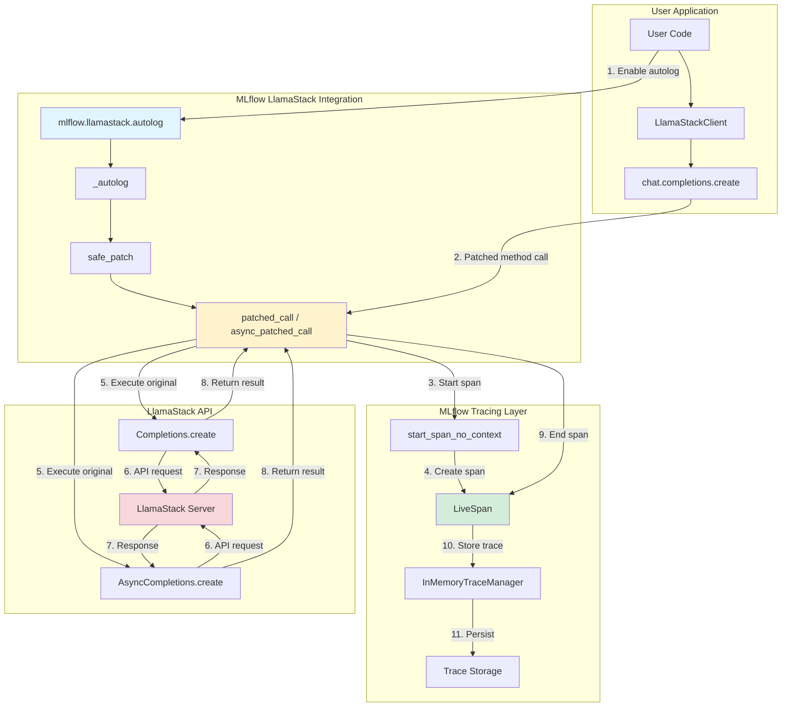
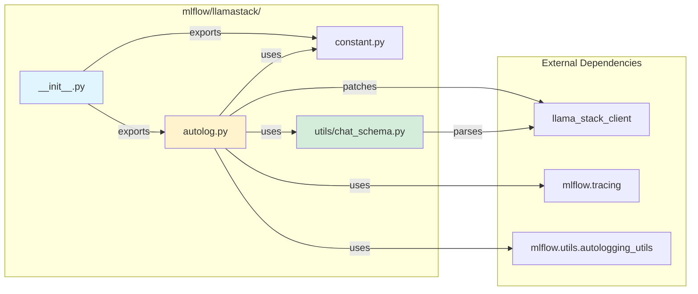
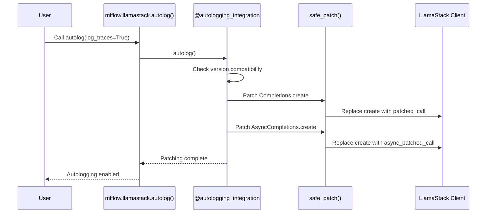
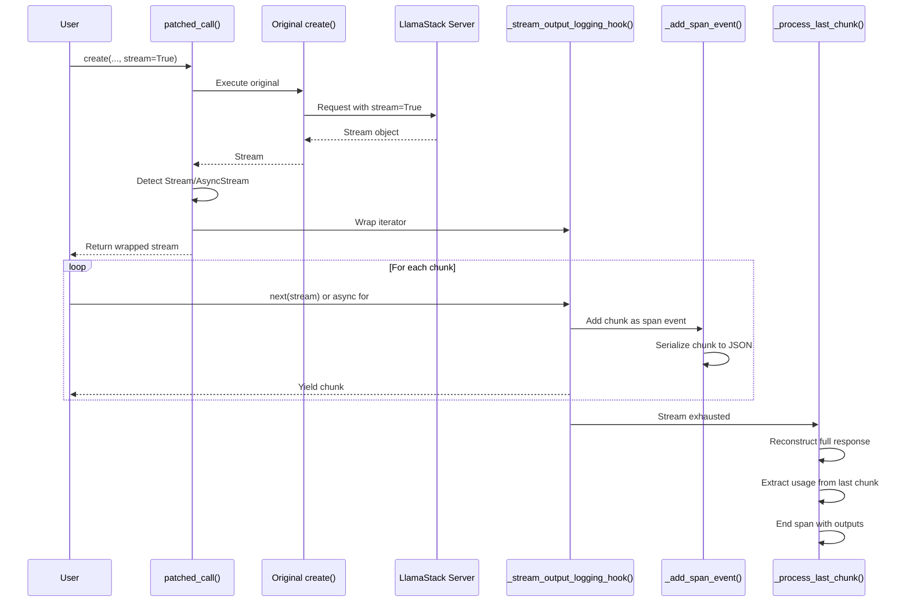
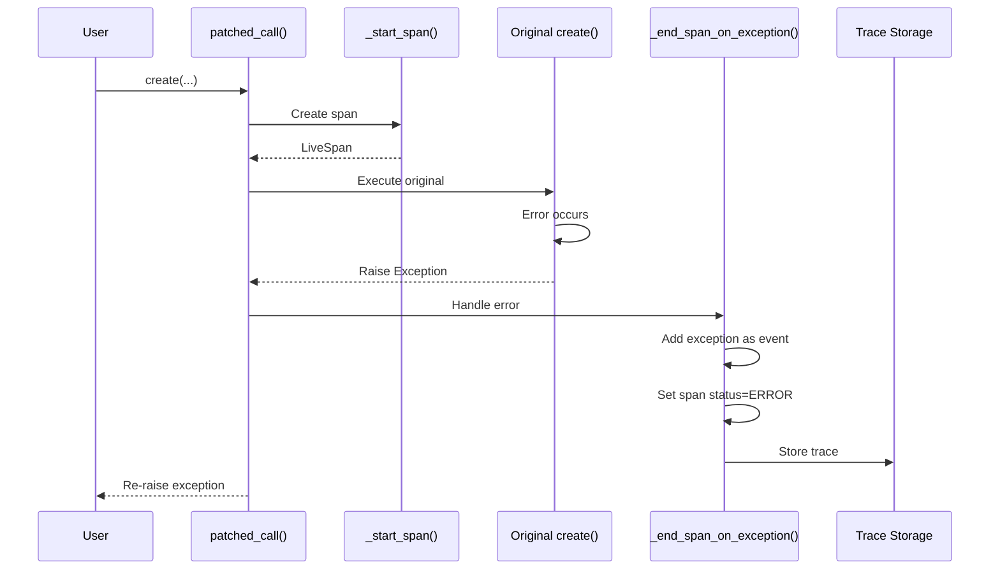

# MLflow LlamaStack Integration - Architecture

This document describes the architecture and workflow of the MLflow LlamaStack autologging integration.

## Table of Contents

- [Overview](#overview)
- [Architecture Diagram](#architecture-diagram)
- [Component Details](#component-details)
- [Workflow Diagrams](#workflow-diagrams)
- [Integration Points](#integration-points)
- [Design Decisions](#design-decisions)

## Overview

The MLflow LlamaStack integration provides automatic logging and tracing for LlamaStack API calls. It follows the established pattern used by other GenAI integrations (OpenAI, Anthropic, Groq) in MLflow.

### Key Features

- **Automatic Tracing**: All `chat.completions.create()` calls are automatically traced
- **Sync & Async Support**: Handles both synchronous and asynchronous API calls
- **Streaming Support**: Infrastructure for streaming response handling
- **Token Usage Tracking**: Captures input/output/total token counts
- **Model Attribution**: Records model name in span attributes
- **Minimal Dependencies**: Uses lazy imports; llama-stack-client only required at runtime

## Architecture Diagram

### High-Level Component Architecture



### Module Structure



## Component Details

### 1. Entry Point (`__init__.py`)

**Purpose**: Package initialization and public API exports

**Exports**:
- `autolog()` - Main autologging function
- `FLAVOR_NAME` - Integration identifier ("llamastack")

```python
from mlflow.llamastack.autolog import autolog
from mlflow.llamastack.constant import FLAVOR_NAME

__all__ = ["autolog", "FLAVOR_NAME"]
```

### 2. Constants (`constant.py`)

**Purpose**: Centralized constant definitions

**Constants**:
- `FLAVOR_NAME = "llamastack"` - Unique identifier for this integration

### 3. Core Autologging (`autolog.py`)

**Purpose**: Implements the autologging logic, method patching, and tracing

**Key Functions**:

| Function | Purpose | Return Type |
|----------|---------|-------------|
| `autolog()` | Public API for enabling/disabling autologging | `None` |
| `_autolog()` | Internal autolog implementation with `@autologging_integration` | `None` |
| `patched_call()` | Wrapper for synchronous API calls | `Any` |
| `async_patched_call()` | Wrapper for asynchronous API calls | `Any` |
| `_start_span()` | Creates and configures a new span | `LiveSpan` |
| `_end_span_on_success()` | Finalizes span with outputs | `None` |
| `_end_span_on_exception()` | Handles span on error | `None` |
| `_process_last_chunk()` | Processes streaming response chunks | `None` |
| `_reconstruct_completion_from_stream()` | Reconstructs full response from chunks | `ChatCompletion` |
| `_add_span_event()` | Adds streaming chunk as span event | `None` |

**Patching Targets**:
```python
CompletionsResource.create          # Sync chat completions
AsyncCompletionsResource.create     # Async chat completions
```

### 4. Utility Functions (`utils/chat_schema.py`)

**Purpose**: Parse and set chat-related span attributes

**Key Functions**:

| Function | Purpose |
|----------|---------|
| `set_span_chat_attributes()` | Main entry point for setting all chat attributes |
| `_parse_usage()` | Extract token usage from response |

## Workflow Diagrams

### 1. Autolog Initialization Flow



### 2. Sync Chat Completion Flow

```mermaid
sequenceDiagram
    participant User
    participant Client as LlamaStackClient
    participant Patched as patched_call()
    participant Span as _start_span()
    participant Original as Original create()
    participant API as LlamaStack Server
    participant End as _end_span_on_success()
    participant Storage as Trace Storage

    User->>Client: client.chat.completions.create(...)
    Client->>Patched: Intercepted call
    Patched->>Patched: Check AutoLoggingConfig
    alt log_traces=True
        Patched->>Span: Create span
        Span->>Span: Set inputs & attributes
        Span-->>Patched: LiveSpan
    end
    Patched->>Original: Execute original method
    Original->>API: HTTP request
    API-->>Original: ChatCompletion response
    Original-->>Patched: Return result
    alt log_traces=True
        Patched->>End: Finalize span
        End->>End: Parse usage & model
        End->>End: Set outputs
        End->>Storage: Store trace
    end
    Patched-->>User: Return result
```

### 3. Async Chat Completion Flow

```mermaid
sequenceDiagram
    participant User
    participant Client as LlamaStackClient
    participant Patched as async_patched_call()
    participant Span as _start_span()
    participant Original as Original create()
    participant API as LlamaStack Server
    participant End as _end_span_on_success()
    participant Storage as Trace Storage

    User->>Client: await client.chat.completions.create(...)
    Client->>Patched: Intercepted async call
    Patched->>Patched: Check AutoLoggingConfig
    alt log_traces=True
        Patched->>Span: Create span
        Span->>Span: Set inputs & attributes
        Span-->>Patched: LiveSpan
    end
    Patched->>Original: await original method
    Original->>API: Async HTTP request
    API-->>Original: ChatCompletion response
    Original-->>Patched: Return result
    alt log_traces=True
        Patched->>End: Finalize span
        End->>End: Parse usage & model
        End->>End: Set outputs
        End->>Storage: Store trace
    end
    Patched-->>User: Return result
```

### 4. Streaming Response Flow



### 5. Error Handling Flow



## Integration Points

### 1. MLflow Tracking Registration

**File**: `mlflow/tracking/fluent.py`

```python
GENAI_LIBRARY_TO_AUTOLOG_MODULE = {
    ...
    "llama_stack_client": "mlflow.llamastack",
    ...
}
```

**Purpose**: Enables `mlflow.autolog()` to automatically detect and enable LlamaStack autologging when `llama_stack_client` is imported.

### 2. Package Version Management

**File**: `mlflow/ml_package_versions.py`

```python
_ML_PACKAGE_VERSIONS = {
    ...
    "llamastack": {
        "package_info": {
            "pip_release": "llama-stack-client"
        },
        "autologging": {
            "minimum": "0.4.0",
            "maximum": "1.0.0"
        }
    },
    ...
}

GENAI_FLAVOR_TO_MODULE_NAME = {
    ...
    "llamastack": "llama_stack_client",
    ...
}
```

**Purpose**:
- Defines supported package versions
- Maps flavor name to module name
- Enables version compatibility checking

### 3. Tracing Infrastructure

**Uses**:
- `mlflow.tracing.fluent.start_span_no_context()` - Create spans
- `mlflow.entities.span.LiveSpan` - Span representation
- `mlflow.tracing.trace_manager.InMemoryTraceManager` - Trace storage
- `mlflow.entities.span.SpanType.CHAT_MODEL` - Span type classification

### 4. Autologging Framework

**Uses**:
- `mlflow.utils.autologging_utils.autologging_integration` - Decorator for integration registration
- `mlflow.utils.autologging_utils.safety.safe_patch` - Safe method patching
- `mlflow.utils.autologging_utils.config.AutoLoggingConfig` - Configuration management

## Design Decisions

### 1. OpenAI-Compatible Response Handling

**Decision**: Reuse OpenAI's response structure patterns

**Rationale**:
- LlamaStack API is OpenAI-compatible
- Reduces code duplication
- Leverages battle-tested parsing logic

**Implementation**:
```python
# Similar token usage structure
{
    TokenUsageKey.INPUT_TOKENS: usage.prompt_tokens,
    TokenUsageKey.OUTPUT_TOKENS: usage.completion_tokens,
    TokenUsageKey.TOTAL_TOKENS: usage.total_tokens,
}
```

### 2. Lazy Imports

**Decision**: Import `llama_stack_client` only when needed

**Rationale**:
- Reduces startup overhead
- Allows MLflow to function without llama-stack-client installed
- Only patches when autolog is explicitly called

**Implementation**:
```python
@autologging_integration(FLAVOR_NAME)
def _autolog(...):
    # Import only when autolog is called
    from llama_stack_client.resources.chat.completions import (
        AsyncCompletions,
        Completions,
    )
```

### 3. Message Format Identifier

**Decision**: Set `message_format = "llamastack"`

**Rationale**:
- Distinguishes LlamaStack calls from pure OpenAI calls
- Enables downstream analysis and filtering
- Follows pattern from other integrations (anthropic, groq)

**Implementation**:
```python
attributes[SpanAttributeKey.MESSAGE_FORMAT] = "llamastack"
```

### 4. Streaming Support Structure

**Decision**: Hook into iterator for streaming responses

**Rationale**:
- Captures all chunks as span events
- Allows reconstruction of full response
- Provides detailed streaming observability
- Matches OpenAI integration pattern

**Implementation**:
```python
def _stream_output_logging_hook(stream: Iterator) -> Iterator:
    output = []
    for i, chunk in enumerate(stream):
        _add_span_event(span, i, chunk)
        output.append(chunk)
        yield chunk
    _process_last_chunk(span, chunk, inputs, output)
```

### 5. Separate Sync/Async Patching

**Decision**: Patch both `Completions.create` and `AsyncCompletions.create`

**Rationale**:
- LlamaStack provides separate sync/async client classes
- Each requires its own patch function
- Ensures proper async/await handling

**Implementation**:
```python
safe_patch(FLAVOR_NAME, CompletionsResource, "create", patched_call)
safe_patch(FLAVOR_NAME, AsyncCompletionsResource, "create", async_patched_call)
```

### 6. Minimal Test Dependencies

**Decision**: Use mocked `llama_stack_client` in tests

**Rationale**:
- No external server required for testing
- Fast test execution
- Consistent test environment
- CI/CD friendly

**Implementation**:
```python
@pytest.fixture(autouse=True)
def mock_llamastack_client():
    # Create mock classes
    class Completions:
        def create(self, **kwargs):
            return mock_response

    # Register in sys.modules
    sys.modules["llama_stack_client.resources.chat.completions"] = mock_completions
```

## Extensibility

### Future Enhancements

The architecture supports future additions:

1. **Additional API Endpoints**
   - Embeddings: `client.embeddings.create()`
   - Agents: `client.agents.create()`
   - Tools: `client.tool_runtime.invoke()`

2. **Advanced Features**
   - Model logging/saving
   - Prompt engineering support
   - Safety/shield integration
   - Fine-tuning trace integration

3. **Observability**
   - Cost tracking (token pricing)
   - Latency monitoring
   - Error analytics
   - Usage dashboards

### Adding New API Support

To add support for a new LlamaStack API:

1. **Identify the target class and method**
   ```python
   from llama_stack_client.resources.embeddings import Embeddings
   ```

2. **Add patch in `_autolog()`**
   ```python
   safe_patch(FLAVOR_NAME, Embeddings, "create", patched_embedding_call)
   ```

3. **Create appropriate span type**
   ```python
   span_type = SpanType.EMBEDDING  # For embeddings
   ```

4. **Add tests**
   ```python
   def test_embeddings_autolog(is_async):
       mlflow.llamastack.autolog()
       # Test implementation
   ```

## Performance Considerations

### Overhead

- **Span Creation**: ~1-2ms per API call
- **Attribute Setting**: Minimal (<0.1ms)
- **Streaming Events**: ~0.1ms per chunk
- **Total**: Typically <5% of API call latency

### Optimization Strategies

1. **Lazy Evaluation**: Span attributes computed only when trace is enabled
2. **Efficient Serialization**: Uses `TraceJSONEncoder` for complex objects
3. **Minimal Copying**: Passes inputs/outputs by reference when possible
4. **Async-Safe**: No blocking operations in async code path

## Security Considerations

1. **API Keys**: Never logged in spans (excluded from inputs)
2. **Message Content**: Logged by default (users can filter sensitive data)
3. **Model Names**: Safe to log
4. **Token Counts**: Safe to log (no PII)

### Recommended Practices

```python
# Sanitize sensitive data before logging
mlflow.llamastack.autolog(
    log_traces=True,
    # Add custom filtering if needed
)

# Or disable logging for sensitive operations
mlflow.llamastack.autolog(log_traces=False)
# Make sensitive API calls
mlflow.llamastack.autolog(log_traces=True)
```

## Troubleshooting

### Common Issues

1. **Traces Not Appearing**
   - Ensure `autolog()` is called before API calls
   - Check `log_traces=True` (default)
   - Verify MLflow tracking is configured

2. **Import Errors**
   - `llama_stack_client` must be installed for runtime use
   - Tests use mocks, so package not required for testing

3. **Async Issues**
   - Use `await` with async client methods
   - Ensure event loop is properly managed

## References

- [MLflow Tracing Documentation](https://mlflow.org/docs/latest/llms/tracing/index.html)
- [LlamaStack Documentation](https://github.com/meta-llama/llama-stack)
- [OpenAI Integration](../openai/README.md) - Similar pattern reference
- [Autologging Utils](../../utils/autologging_utils/README.md)
